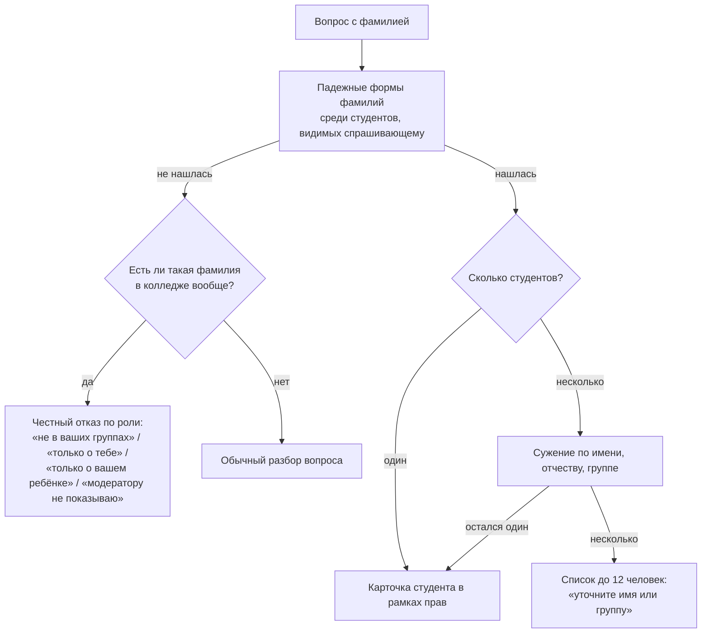

# Вектор: кто что может узнать

Схема доступа ИИ-помощника «Вектор» к данным о студентах — по ролям. Составлена 01.10.2026
вместе с починкой «Вектор не отвечает по фамилии студента». Правда — в коде; при
расхождении верить коду и поправить этот файл тем же заходом.

## Три правила, на которых держится всё остальное

1. **Цифры берёт база, а не модель.** Ответ собирает SQL по роли спрашивающего; языковая
   модель (если подключена) только переформулирует готовый текст.
2. **Права проверяет сервер на каждом вопросе.** Скрытая кнопка или «умный» клиент защитой
   не считаются: одна и та же дверь обслуживает сайт, программу, приложение и команду
   `/vector` в мессенджере.
3. **ФИО не уходит в модель никогда.** Если в вопросе или ответе есть фамилия человека из
   справочника, ответ отдаётся как есть, без озвучки моделью (одна дверь —
   `_names_a_person` в `server/app/routers/web/vector.py`).

## Кто какие данные о студентах видит

| Что спрашивают | Админ | Куратор (своя группа) | Преподаватель (группа, где ведёт) | Студент | Родитель (привязка подтверждена) | Модератор |
|---|---|---|---|---|---|---|
| Сводка по колледжу, число студентов, группы | ✅ | — | — | — | — | — |
| Состав группы, должники, зона риска, пропуски группы | ✅ любая группа | ✅ все предметы группы | ✅ только свои предметы | ❌ «это данные преподавателя» | ❌ | ❌ |
| **Студент по фамилии**: оценки, средний, пропуски, долги | ✅ любой | ✅ все предметы | ✅ только свои предметы | ❌ про других — отказ | ❌ про чужих — отказ | ❌ отказ |
| ЗЕТ конкретного студента | ✅ | ✅ | ❌ «видит куратор и администрация» | своё — ✅ | ребёнка — ✅ | ❌ |
| Свои оценки, средний, долги, пропуски, ДЗ, ЗЕТ | — | — | — | ✅ | ✅ ребёнка | — |
| Расписание любой группы | ✅ | ✅ | ✅ | ✅ (публичное) | ✅ | ✅ |
| Кто ведёт предметы | ✅ | ✅ | ✅ | ✅ своей группы | ✅ | ✅ |
| Состояние сервера | ✅ | ❌ | ❌ | ❌ | ❌ | ❌ |

- **Куратор** — преподаватель, у которого группа записана в «курируемые». Нагрузка ему для
  этого не нужна: куратор без единого предмета в своей группе видит её целиком.
- **Преподаватель**, который ведёт в группе один предмет, видит у студента только этот
  предмет: средний «по всем предметам» ему не показывается.
- **Родитель без подтверждения студентом** не получает ничего: сервер отвечает «Нет
  подтверждённого доступа к журналу» (в колледже учатся совершеннолетние, 152-ФЗ).
- **Модератор** — сотрудник без доступа к успеваемости: расписание и преподаватели, всё
  остальное — отказ с объяснением.

## Как Вектор находит студента по фамилии

- **Любой падеж.** Формы строятся по окончанию фамилии: Иванов → Иванова, Иванову,
  Ивановым, Иванове; Иванова → Ивановой, Иванову; Ковальский → Ковальского, Ковальскому;
  Ковальская → Ковальской; несклоняемые (Шевченко, Черных) — как есть.
- **Мужская и женская форма рядом.** «Алексеева» — это и родительный падеж от Алексеев, и
  женская фамилия; Вектор не выбирает за человека, а показывает обоих и просит уточнить.
- **Отчество — не фамилия.** «Хандакова Евгения Николаевича» ищет Хандакова, а не
  Николаева: формы фамилии сравниваются с целыми словами.
- **Имя сужает однофамильцев.** «Борисов Кирилл», «оценки Борисова Кирилла» — выбирается
  Кирилл даже при двух Борисовых в одной группе.
- **Своя фамилия студента** — вопрос о себе; **фамилия своего ребёнка** у родителя —
  вопрос о ребёнке.

## Где это в коде

| Что | Где |
|---|---|
| Падежные формы и поиск фамилий (общий модуль сервера и офлайн-разбора в приложении) | `vector_nlu.py`: `surname_forms`, `find_surnames`; зеркало `web/src/utils/vectorNlu.js` |
| Выбор студента и сужение по имени | `server/app/routers/web/vector.py`: `_find_students`, `_narrow_by_name`, `_namesakes_answer` |
| Отказ вне области видимости | там же, `_outside_scope_answer` |
| Ответы по ролям | там же, `_admin_facts`, `_teacher_facts`, ветка студента в `_vector_facts` |
| Родитель | `server/app/routers/parent.py::parent_vector_ask`; общая дверь перенаправляет на ребёнка (`answer_vector_question`) |
| Тесты | `server/tests/test_vector_surnames.py`, `test_vector_roles.py`, `test_vector_never_voices_names.py`; контракт разбора `docs/contracts/vector-intent-cases.json` |
